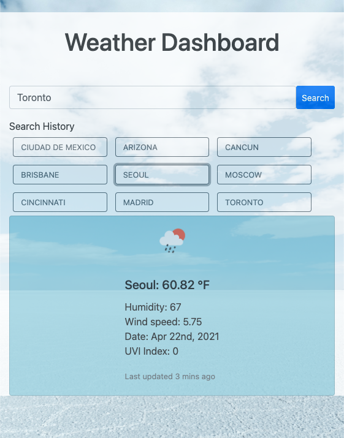

# Weather Dashboard

## Description

Travelers can see the weather outlook for multiple cities, so that they can plan a trip with the information provided.

## Features

Travelers are presented with a dashboard, where they can input the city and click the search button to display the current weather and a five day forecast for that selected city.

Their searches are stored, so that travelers can revisit the information as many times as they wish.

Information available:
- Icon representing the weather conditions
- City Name
- Date
- Temperature
- Humidity
- Wind Speed
- UV Index

Forecast information:
- Icon
- Date
- Temperature
- Wind speed
- Humidity

## Resources:
* API - [OpenWeather One Call API](https://openweathermap.org/api/one-call-api)
* Moment
* Bootstrap v.4.6
* Sass
* Free weather image from unsplash.com
(https://unsplash.com/photos/AM53LSIBnRo)

_______________________________________________

## Sample Image

_______________________________________________

## Link to website
[Link to Website](https://adina-hc.github.io/weather-dashboard/)
